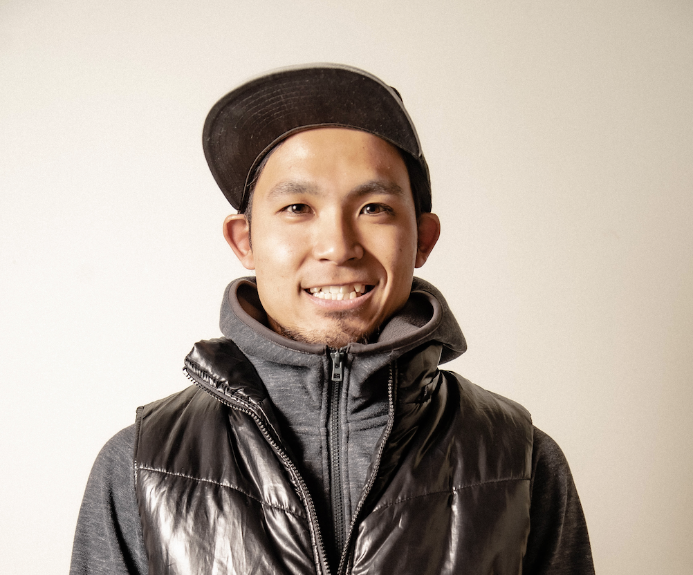

## About

こんにちは。関西大学4回生の木村修平です。  
大学では主にマーケティングを学んでいました。  
2年休学して自分のやってみたいことに取り組んでいました。具体的には世界一周、留学、瞑想、登山、インターン、プログラミングになります。  
自分が作りたい世界観は「世界をもっとカラフルに」です。毎日同じ日常に対して退屈さや不満を抱えている人に対して、小さな変化で毎日をもっと楽しんでもらいたいと言う思いです。  
  
  
## Profile  
  
・木村修平  
・大阪北摂出身。  
　現在は大阪市内で友人4人とシェアハウスしています。  
・趣味  
　読書。  
 ・学んでいること  
  Java  
  JavaScript  
  Scala  
  Python  
  PHP  
  Ruby  
  
    
## My SNS  
  
[Twitter](https://twitter.com/x6_kim)   
  
[Instagram](https://www.instagram.com/x66.kim/?hl=ja)  
  
[Facebook](https://www.facebook.com/profile.php?id=100009208309858)  
  
  
## Works  

<iframe src="https://www.openprocessing.org/sketch/1009939/embed/" width="400" height="300"></iframe>
  
  
[Tetris(file:///Users/kimurashuuhei/workspace/%E3%83%86%E3%83%88%E3%83%AA%E3%82%B9/%E3%83%86%E3%83%88%E3%83%AA%E3%82%B9.html)  
